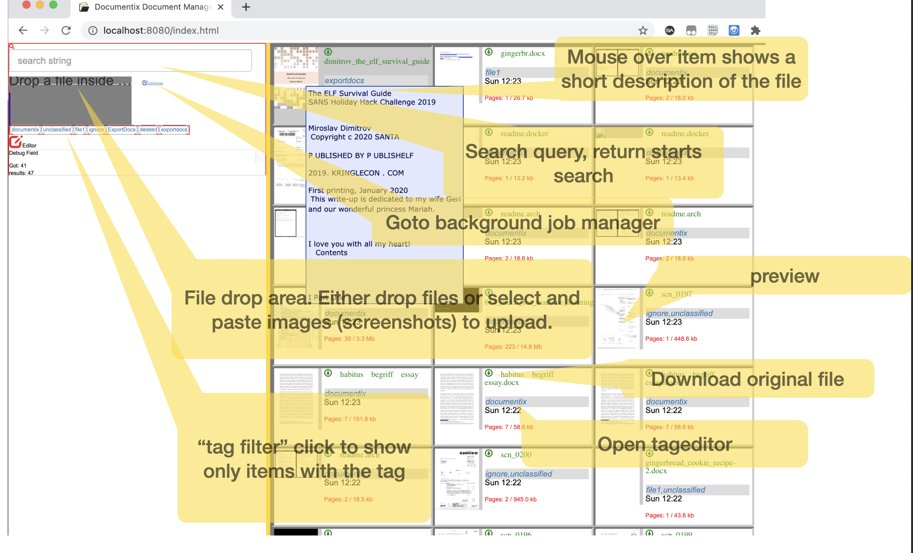

# Documentix

Documentix is a smart document management tool

## Source

    available from 
* [github](https://github.com/thilo-hub/documentix/tree/mojofw) 

## Usage

Eseentially you view the [root](//index.html) web-page
and enter search queries... and click on the icon to view...

Adding new documents works in multiple ways:

-   Drag and Drop local file to browser window
-   copy and paste images using the paste buffer ( think Windows-shift-S
    and Control-V )
-   Tell the running instance to import a locally accessible file
-   Ask a build-in importer ( for example the MX870-office-printer ) to
    load available scanns

You might have noticed, image or scans usually show text, but it's hard
to search in it. Documentix solves this by internally OCR'ing all
documents that seem to no have text. These documents are then by default
shown in the main window and their content is searched for.

## Features

- Convert images or scanned pdf's into searchable pdfs
- Uses porter or stemmer fulltext search in all documents (sqlite)
- Labels - Maintains user settable and automated labeling of documents to cluster information
- Extract date information from files and offers date-range searches
- Extract QR-Code information from images/scann and offers a short-cut to the files
- QR and normal file-links can be exposed publicly without risk that other documents are exposed.

-

## Usefull links

-   [MX870 Scanner]($HOST/import)
-   [Minion manager]($HOST/minion)
-   [Fix Database - simple]($HOST/fixsearchdb)
-   [Refresh local files]($HOST/refresh)

`<a href="//minion" target="_blank">`{=html}Learn
Markdown!`</a>`{=html}

## Supported documents

There are a number of converters before a "pdf" with text can be achieved. There is some small section in pdfidx.pm that handles this.
Essentially the below mime-types are able to be converted.

| Mime type           |     Processor style    |
|---------------------|------------------------|
| text/\*             |  pandoc (markdown...)  |
| application/zip     |  recursive parse content |
| application/x-gzip  |   recursive parse content |
| application/x-tar   |   recursive parse content |
| application/gzip    |   recursive parse content |
| application/pdf     |  ocr if no text
| application/msword  |  Libreoffice
| image/png           |  iMageMagic & Ocr       |
| image/jpeg          |  iMageMagic & Ocr       |
| image/jpg           |  iMageMagic & Ocr       |
| application/vnd.openxmlformats-officedocument.presentationml.presentation | Libreoffice |
| application/vnd.openxmlformats-officedocument.spreadsheetml.sheet | Libreoffice |
| application/vnd.openxmlformats-officedocument.wordprocessingml.document | Libreoffice |
| application/epub+zip          | calibre   |
| application/vnd.ms-powerpoint | Libreoffice |

* Note: This document (Markdown) is zipped together with its assets/images. Documentix will be able to create a pdf if everything  is part of the same archive

## Installation

### Docker

Docker is the simplest way.

This will create a docker-internal persistent volume named "database" and use a folder "Documents" in you current directory

* Run
`docker run  -ti -p 8080:80 --name documentix --volume $PWD/Documents:/volumes/Docs -v database:/volumes/db   --rm thiloj/documentix`

The database is usually not that interesting, but recreating would be anoying. All tagging and predictive data is kept as well as the search indexes...
This installation, now shares the Folders
`Documents/.... `
and uses 
`Documents/uploads` to safe uploaded files. Be aware the structure is machine-readable... You are not going to like it...

If you have an existing tree underneath Documents, all folder will be labels to you documents

(if you don't like to see the output of the tool, just remove `-ti` and use `-d` to have it in the background:

`docker run  -d -p 8080:80 --name documentix --volume $PWD/Documents:/volumes/Docs -v database:/volumes/db   --rm thiloj/documentix`

Stop documentix:

`docker stop documentix`

* Documentation can be loaded into documentix using:

`docker exec -ti documentix /documentix/script/install_manual.sh 'http://localhost:8080'`

Some internal notes and other (maybe outdated) will be installed using:

`docker exec -ti documentix /documentix/script/install_documentation`

### Local filesystem

Please check which tools are needed and make sure they are installed.
(The list will come soon)

You will need a configuration [file](https://github.com/thilo-hub/documentix/blob/mojofw/documentix.conf.tmpl)
 
This must be available under the name documentix.conf in the current working directory.
The configuration is used as is for docker images, but can be changed for local needs.

It essentially configures

| Entry       |       Default      |  Usage  |
|-------------|--------------------|---------|
| auth_disable            |  1                       |   |
| browser_start           |  0                       | |
| cache_db                |  "db/doc_cache.db"       | caching database |
| cache_db_pass           |  ""                      | |
| cache_db_provider       |  "SQLite"                | |
| cache_db_user           |  ""                      | |
| cgi_enabled             |  1                       | |
| database                |  "db/doc_db.db"          | main database |
| database_pass           |  ""                      | |
| database_provider       |  "SQLite"                | |
| database_user           |  ""                      | |
| debug                   |  2                       | |
| debug_js                |  1                       | |
| database_extensions     |  ['fts5stemmer.so']      | full-text search uses it |
| ebook_convert_enabled   |  0                       | |
| icon_size               |  100                     | |
| index_html              |  "index.html"            | Entry page |
| link_local              |  0                       | |
| local_storage           |  "Docs/uploads"          | Uploaded files are stored .../XX/YYYYY/ , XX are the first 2 chars of the MD5 and YYY is the MD5 of the base file |
| lockfile                |  "db/db.lock"            | |
| number_ocr_threads      |  2                       | number of tesseract instances. Watchout, tesseract forks heavily nowadays |
| number_server_threads   |  20                      |  |
| results_per_page        |  10                      | |
| root_dir                |  "Docs"                  | All documents under here are readble by the tool |
| unclassified_folder     |  "Unsorted|unclassified" | |
| unoconv_enabled         |  1                       | |
| pop_userdir             |   "db/popuser"           | |
| popfile_xmlrpc_port     |  8081                    | |
| popfile_html_port       |  8080                    |  service port for the classifier  |
| popfile_html_local      |  0                       | |

Docs:  TODO

--- Starting:

perl ../../documentix.mojofw/script/documentix daemon -l http://*:7265

## Inside stuff 

### Usefull web-endpoints

Make an object invisible:

`curl  -F json_string='{"op":"add","md5":"'$MD5'","tag":"deleted"}' //tags`

Upload a document

`curl --data-binary "@$DOC"  -H"X-File-Name:$DOC"  //upload`

Sample Image 

### Debugging..

Of course...

documetix uses Mojolicious heavyly, `perldoc Mojolicious`

Typical debugging sessions I use are:

- To rerun and debug the job 163

`perl -d ../../documentix.mojofw/script/documentix minion job -f 163`

- Using `$DB::single=1` in the source code helps getting fast

- Upload a new file:

`perl ../../documentix.mojofw/script/documentix get -M POST < ../MKDoc/doc.zip   -H "X-File-Name:doc.zip" /upload`

- Check what jobs are qued

`perl ../../documentix.mojofw/script/documentix minion job`

